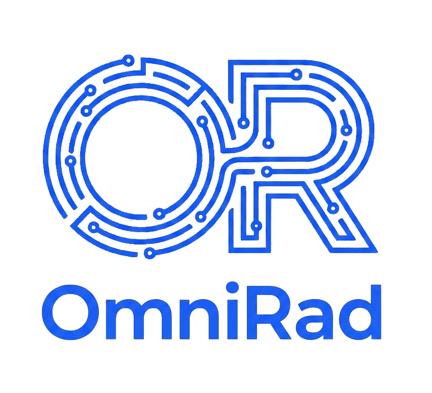

<p align="center">
  
</p>

<h1 align="center">OmniRad</h1>
<p align="center">
  <strong>Open-Source AI-Powered Radiology Workstation</strong>
</p>

<p align="center">
  <a href="#-features">Features</a> •
  <a href="#-architecture">Architecture</a> •
  <a href="#-getting-started">Getting Started</a> •
  <a href="#-ai-providers">AI Providers</a> •
  <a href="#-pacs--dicom">PACS & DICOM</a> •
  <a href="#-fhir-r4-integration">FHIR R4</a> •
  <a href="#-security--compliance">Security</a> •
  <a href="#-contributing">Contributing</a>
</p>

<p align="center">
  
  
  
  
  
  
</p>

---

## 📸 Screenshots

<p align="center">
  
</p>
<p align="center"><em>Dashboard — Generate AI-powered radiology reports from patient data & medical images</em></p>

<br />

<p align="center">
  
</p>
<p align="center"><em>Reports History — Review, approve, edit, and export reports with full audit trail</em></p>

---

## ✨ Features

### 🧠 AI Report Generation
- Upload medical images (X-Ray, CT, MRI, Ultrasound) with patient context and receive structured, clinically formatted radiology reports in seconds.
- Powered by **LangGraph** multi-step agent workflow with structured output parsing and automatic JSON extraction fallback.
- Reports include **Findings** (with anatomical regions & status), **Impression**, **Urgency classification**, and **Recommendations**.

### 🤖 AI Copilot Workspace
- Interactive **split-pane workspace** combining a DICOM image viewer with a conversational AI assistant.
- **Streaming SSE responses** with real-time activity indicators (Thinking → Searching → Fetching → Generating).
- Natural language commands to search patients, retrieve reports, compare studies, and navigate imaging data.
- **AI-powered image segmentation & annotation** — ask the copilot to highlight findings, segment structures, or annotate report-grounded observations directly on the image.
- Annotation styles automatically adapt: **arrows** for pointing, **circles** for lesions, **bounding boxes** for localization, **overlays** for diffuse findings.
- **Slice navigation** — ask "take me to the slice with the lesion" and the copilot locates and navigates to the relevant slice.
- Persistent **chat history** with session management.

### 🖼️ Medical Image Viewing
- Built-in **Cornerstone.js v4** DICOM viewer with full rendering pipeline.
- Window/Level adjustment, zoom, pan, and standard radiological tools.
- Support for multi-frame / multi-slice DICOM series with slice navigation.
- Inline image viewer for standard formats (JPEG, PNG) when DICOM is unavailable.

### 🏥 PACS / DICOMweb Integration
- Connect to any **Orthanc** or DICOMweb-compliant PACS server.
- Browse, search, and filter studies by patient name, modality, date range, and study description.
- Pull individual series into the DICOM viewer or directly into report generation.
- Configurable authentication: **None**, **Basic Auth**, or **Bearer Token**.

### 🔗 HL7 FHIR R4 Integration
- Expose and consume **FHIR R4** resources:
  - `Patient` — demographics mapping
  - `DiagnosticReport` — structured report output
  - `ImagingStudy` — study references
  - `ServiceRequest` — order management
- Connect to external FHIR servers (Epic, Cerner, HAPI FHIR, etc.) for bidirectional data exchange.

### 👥 Patient Management
- Full **patient registry** with demographics, contact info, and clinical notes.
- Patient search with fuzzy matching.
- **Timeline view** showing all reports, studies, and interactions per patient.
- Patient-linked reports with cascade deletion.

### 📄 Report Management & Export
- Three built-in report **templates**: Standard, Modern, and Minimal.
- Rich inline **report editor** for radiologist review and modification.
- **Approval workflow** — Approve, Reject, or mark as Pending with audit logging.
- **PDF export** with hospital branding (custom logo + hospital name), digital signature support, and professional formatting.
- Full report overlay view with section-by-section navigation.

### 💾 Hybrid Storage Model
| Layer | Technology | Purpose |
|-------|-----------|---------|
| **Local** | SQLite + Drizzle ORM | Primary storage, offline-first, full DICOM image caching |
| **Cloud** | Supabase (PostgreSQL) | Optional cloud sync — images are auto-stripped before upload to save bandwidth |

### 👤 User Management & Authentication
- **Multi-user support** with role-based access (**Admin** / **User**).
- Session-based authentication with secure cookie management.
- First-run **setup wizard** for initial admin account creation.
- **App Lock toggle** — admins can disable login requirements for single-user deployments.
- Auto-login flow for unlocked mode.

### ⚙️ Flexible AI Configuration
- Configure **separate AI providers** for Report Generation and Copilot.
- Support for multiple LLM providers (see [AI Providers](#-ai-providers)).
- Per-provider settings: model selection, temperature, max tokens, timeout.
- **LangSmith** integration for AI observability and tracing.
- Built-in **connection test** with automatic model discovery.

### 🎨 Appearance & Branding
- **Dark / Light mode** with zero-flash theme switching.
- Customizable **hospital branding** — logo upload and hospital name for all exports.
- Switchable **report templates** with live preview.

---

## 🏗 Architecture

```
┌──────────────────────────────────────────────────────────────┐
│                    OmniRad Application                       │
│                                                              │
│  ┌────────────────────┐       ┌────────────────────────┐     │
│  │   Next.js 16 App   │       │   Python AI Service    │     │
│  │   (React 19 + SSR) │◄─────►│   (FastAPI + LangGraph)│     │
│  │                    │  REST │                        │     │
│  │  • Dashboard       │       │  • Report Generation   │     │
│  │  • Copilot UI      │  SSE  │  • Copilot Agent       │     │
│  │  • PACS Browser    │◄─────►│  • Segmentation        │     │
│  │  • Patient Mgmt    │       │  • AI Annotation       │     │
│  │  • Report Viewer   │       │                        │     │
│  │  • Settings        │       │  Providers:            │     │
│  │  • Admin Panel     │       │  ├─ Google Gemini      │     │
│  └────────┬───────────┘       │  ├─ OpenAI / Azure     │     │
│           │                   │  ├─ Ollama (local)     │     │
│           │                   │  └─ Any OpenAI-compat. │     │
│  ┌────────▼───────────┐       └────────────────────────┘     │
│  │     Data Layer     │                                      │
│  │  ┌──────────────┐  │  ┌──────────────┐ ┌──────────────┐   │
│  │  │ SQLite       │  │  │ Supabase     │ │ PACS/Orthanc │   │
│  │  │ (Drizzle ORM)│  │  │ (Cloud Sync) │ │ (DICOMweb)   │   │
│  │  └──────────────┘  │  └──────────────┘ └──────────────┘   │
│  └────────────────────┘                                      │
└──────────────────────────────────────────────────────────────┘
```

### Tech Stack

| Component | Technology |
|-----------|-----------|
| **Frontend** | Next.js 16, React 19, Tailwind CSS v4 |
| **AI Backend** | Python 3.13, FastAPI, LangGraph, LangChain |
| **DICOM Viewer** | Cornerstone.js v4 (core + tools + DICOM loader) |
| **Local Database** | SQLite via better-sqlite3 + Drizzle ORM |
| **Cloud Database** | Supabase (PostgreSQL) |
| **PDF Export** | html2pdf.js |
| **Auth** | bcryptjs + cookie-based sessions |
| **Icons** | lucide-react |
| **FHIR** | Custom HL7 FHIR R4 client |

---

## 🚀 Getting Started

### Prerequisites

| Requirement | Version |
|------------|---------|
| **Node.js** | ≥ 18 |
| **Python** | ≥ 3.13 |
| **uv** | latest ([install](https://docs.astral.sh/uv/getting-started/installation/)) |

### Installation

```bash
# 1. Clone the repository
git clone https://github.com/omniradiology/omnirad.git
cd omnirad

# 2. Install Node.js dependencies
npm install

# 3. Install Python AI service dependencies
cd ai_service
uv sync
cd ..
```

### Running the App

OmniRad runs **two services concurrently** — the Next.js frontend and the Python AI backend:

```bash
# Start both services with a single command
npm run dev
```

This uses `concurrently` to launch:
- **Next.js** on `http://localhost:3000`
- **AI Service** (FastAPI) on `http://localhost:8001`

Alternatively, run them separately:

```bash
# Terminal 1 — Next.js frontend
npm run dev:next

# Terminal 2 — Python AI backend
cd ai_service && python -m uv run main.py
```

### First-Time Setup

1. Open `http://localhost:3000` — you'll be redirected to the **Setup Wizard**.
2. Create your **admin account** (username, email, password).
3. Navigate to **Settings → AI Configuration** to connect your AI provider.
4. Start generating reports from the **Dashboard**!

---

## 🤖 AI Providers

OmniRad supports multiple LLM providers out of the box. Configure them in **Settings → AI Configuration**:

| Provider | Type | Vision Support | Notes |
|----------|------|:--------------:|-------|
| **Google Gemini** | Cloud API | ✅ | Recommended. Models auto-discovered via API. |
| **OpenAI** | Cloud API | ✅ | GPT-4o, GPT-4 Turbo, etc. |
| **Azure OpenAI** | Cloud API | ✅ | Use your Azure endpoint URL. |
| **Ollama** | Local | ✅ | Run models locally. Zero cloud dependency. |
| **Any OpenAI-compatible** | Custom API | Varies | LM Studio, vLLM, Together AI, Groq, etc. |

> **Dual-provider setup**: Configure one provider for **Report Generation** and a different one for **AI Copilot** (e.g., a fast local model for copilot, a powerful cloud model for reports).

### LangSmith Observability

Enable AI tracing by adding your LangSmith API key in the AI configuration panel. All LangGraph runs are automatically traced to your project dashboard.

---

## 🏥 PACS & DICOM

### Connecting to a PACS Server

1. Go to **Settings → PACS Configuration**.
2. Enter your Orthanc / DICOMweb server URL (e.g., `http://localhost:8042`).
3. Select authentication type and provide credentials if required.
4. Save — the PACS browser is now available from the sidebar.

### Supported PACS Features

- **Study-level browsing** with search filters (patient name, modality, date range)
- **Series-level viewing** with thumbnail previews
- **Direct DICOM rendering** via Cornerstone.js
- **Import to report** — pull PACS studies directly into the report generation workflow

---

## 🔗 FHIR R4 Integration

OmniRad implements an **HL7 FHIR R4** interface for healthcare interoperability:

### Exposed Resources

| Resource | Endpoint | Description |
|----------|----------|-------------|
| `Patient` | `/api/fhir/Patient` | Patient demographics |
| `DiagnosticReport` | `/api/fhir/DiagnosticReport` | Structured radiology reports |
| `ImagingStudy` | `/api/fhir/ImagingStudy` | Study references & metadata |
| `ServiceRequest` | `/api/fhir/ServiceRequest` | Radiology orders |

### External FHIR Server

Connect to external FHIR servers (Epic, Cerner, HAPI FHIR) via the **Settings → FHIR Integration** panel to enable bidirectional patient and report exchange.

---

## 🔒 Security & Compliance

OmniRad includes built-in security features designed with healthcare compliance in mind:

| Feature | Implementation |
|---------|---------------|
| **Audit Trail** | Immutable audit logs for all PHI access and modifications (HIPAA §164.312(b)) |
| **PHI Redaction** | Automatic redaction of Protected Health Information from server logs |
| **Role-Based Access** | Admin / User roles with route-level authorization |
| **Rate Limiting** | Per-endpoint rate limiting to prevent abuse |
| **Secrets Management** | Encrypted storage for API keys and credentials |
| **Session Security** | Secure, httpOnly cookie-based sessions with expiration |
| **RBAC Enforcement** | Server-side authorization checks on all API routes |
| **Safe Logging** | PHI-aware logging utilities (`safeLog`, `safeError`, `safeWarn`) |

> ⚠️ **Disclaimer**: OmniRad is an open-source project and is **not** certified for clinical use. Always consult with your compliance team before deploying in a production healthcare environment. AI-generated reports must be reviewed by a qualified radiologist.

---

## 🗄️ Supabase Cloud Sync (Optional)

Enable cloud sync to access your reports from any device:

1. Create a project at [supabase.com](https://supabase.com).
2. Run the following SQL in your Supabase SQL Editor:

```sql
-- Create the reports table
CREATE TABLE public.reports (
  id UUID DEFAULT gen_random_uuid() PRIMARY KEY,
  created_at TIMESTAMPTZ DEFAULT timezone('utc'::text, now()) NOT NULL,
  patient_name TEXT,
  modality TEXT,
  urgency TEXT,
  report_status TEXT DEFAULT 'Pending',
  report_data JSONB NOT NULL
);

-- Enable Row Level Security
ALTER TABLE public.reports ENABLE ROW LEVEL SECURITY;

-- Create access policy (restrict in production)
CREATE POLICY "Enable all access for all users" ON public.reports
  FOR ALL USING (true) WITH CHECK (true);
```

3. Copy your **Project URL** and **Anon Key** from Supabase → Settings → API.
4. Paste them into OmniRad **Settings → Cloud Sync**.

> **Note**: DICOM images are automatically stripped before cloud upload to minimize bandwidth and storage costs. Full image data is always retained locally.

---

## 📁 Project Structure

```
omnirad/
├── app/                     # Next.js App Router pages
│   ├── api/                 # API routes (REST + FHIR)
│   │   ├── ai-config/       # AI provider management
│   │   ├── auth/            # Authentication endpoints
│   │   ├── compliance/      # Compliance & audit APIs
│   │   ├── copilot/         # Copilot proxy endpoints
│   │   ├── fhir/            # FHIR R4 resource endpoints
│   │   ├── pacs/            # PACS/DICOMweb proxy
│   │   ├── patients/        # Patient CRUD
│   │   ├── reports/         # Report CRUD & export
│   │   └── settings/        # App configuration
│   ├── copilot/             # AI Copilot workspace page
│   ├── history/             # Report history page
│   ├── login/               # Login page
│   ├── pacs/                # PACS browser page
│   ├── patients/            # Patient management page
│   ├── reports/             # Report detail pages
│   ├── settings/            # Settings page
│   ├── setup/               # First-run setup wizard
│   └── page.tsx             # Dashboard (report generation)
├── ai_service/              # Python AI backend
│   ├── agent/               # LangGraph agent workflows
│   │   ├── workflow.py      # Report generation pipeline
│   │   ├── copilot_workflow.py   # Copilot chat agent
│   │   ├── copilot_tools.py     # LangChain tools (search, retrieve, view)
│   │   └── segmentation_tools.py # AI segmentation & annotation
│   ├── models/              # Pydantic models & AI model services
│   ├── main.py              # FastAPI entry point
│   └── pyproject.toml       # Python dependencies (uv)
├── components/              # React UI components
│   ├── copilot/             # Copilot workspace components
│   ├── dashboard/           # Dashboard & report generation
│   ├── pacs/                # PACS browser components
│   ├── patients/            # Patient management UI
│   ├── settings/            # Settings panels
│   ├── admin/               # Admin panel (audit logs)
│   ├── layout/              # App shell (sidebar, header)
│   └── ui/                  # Shared UI primitives
├── db/                      # Database schema & migrations
│   ├── schema.ts            # Drizzle ORM schema definitions
│   └── index.ts             # Database connection & initialization
├── lib/                     # Shared utilities
│   ├── api.ts               # Client-side API helpers
│   ├── fhir/                # FHIR R4 resource builders
│   ├── pacs/                # DICOMweb client utilities
│   ├── security/            # Audit, RBAC, PHI redaction, rate limiting
│   ├── dicomImageExtractor.ts
│   ├── dicomMetadataParser.ts
│   ├── pdfHelper.ts         # PDF generation
│   └── reportHtmlGenerator.ts # Report template renderer
├── types/                   # TypeScript type definitions
├── public/                  # Static assets (logos, icons)
├── drizzle.config.ts        # Drizzle ORM configuration
├── middleware.ts             # Auth & setup middleware
├── next.config.ts           # Next.js configuration
└── package.json
```

---

## 🤝 Contributing

Contributions are welcome! To get started:

1. **Fork** the repository
2. **Create** a feature branch
   ```bash
   git checkout -b feature/amazing-feature
   ```
3. **Commit** your changes
   ```bash
   git commit -m "feat: add amazing feature"
   ```
4. **Push** to your branch
   ```bash
   git push origin feature/amazing-feature
   ```
5. **Open** a Pull Request

### Development Notes

- The app uses **Tailwind CSS v4** with CSS custom properties for theming.
- Database migrations are managed via **Drizzle Kit** (`drizzle-kit push` or manual migration scripts).
- The AI service uses **uv** for Python dependency management.
- All AI-related API calls are proxied through the Next.js backend to the FastAPI service.

---

## 📄 License

This project is released under the **MIT License**. See [LICENSE](LICENSE) for details.

---

<p align="center">
  Built with ❤️ by the <a href="https://github.com/omniradiology">OmniRadiology</a> community
</p>
